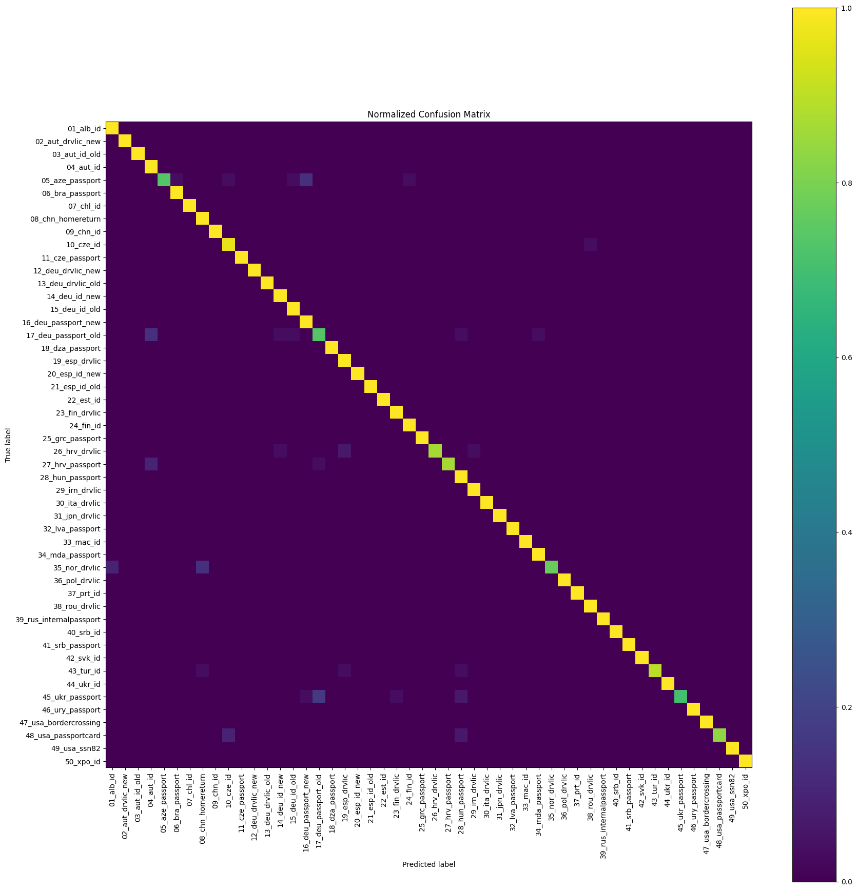

# Document Type Recognition

[](https://colab.research.google.com/github/<your-username>/document-type-recognition/blob/main/document_type_recognition.ipynb)


Classification of **identity document types** (ID cards, passports, driving licences from 50 different countries/versions) from smartphone video frames of the [MIDV-500](https://doi.org/10.18287/2412-6179-2019-43-5-818-824) dataset, using transfer learning on an ImageNet-pretrained **ResNet18**.

| Test accuracy | Macro F1 | Classes | Test frames |
|:-:|:-:|:-:|:-:|
| **96.7%** | **0.967** | 50 | 1,500 |

## Method

<p align="center"></p>

1. **Dataset**: MIDV-500 has 50 document types, each filmed in 10 videos (5 capture conditions × 2 smartphones), with 30 annotated frames per video (15,000 frames in total).
2. **Video-level split**: for each document type the 10 videos are split into **7 train / 2 validation / 1 test**. Frames of the same video are almost identical, so splitting by frame would leak information between train and test. Split sizes: 10,500 / 3,000 / 1,500 frames.
3. **Rectification**: each frame is warped onto the document plane with a homography computed from the annotated document corners (see example above).
4. **Model**: ResNet18 pretrained on ImageNet with a new 50-class head. The backbone is frozen and only the head is trained (AdamW, lr 1e-3, batch 32, 5 epochs, 224×224 input). Light augmentations (Gaussian/motion blur, perspective, affine, brightness/contrast) simulate residual capture artefacts.
5. **Model selection**: the checkpoint with the best validation accuracy is evaluated once on the test videos.

## Results

Training (one run on a Colab T4 GPU):

| Epoch | Train acc | Val acc |
|:-:|:-:|:-:|
| 1 | 0.814 | 0.950 |
| 2 | 0.947 | 0.955 |
| 3 | 0.955 | 0.955 |
| 4 | 0.959 | **0.961** |
| 5 | 0.964 | 0.961 |

On the test set the best checkpoint reaches **96.7% accuracy** and **0.967 macro F1**. 27 out of 50 classes reach a perfect F1 score of 1.00. Most errors involve visually similar passports and documents with a similar layout or colours:

| Class | Recall | Most frequent confusion |
|---|:-:|---|
| `45_ukr_passport` | 0.70 | `17_deu_passport_old` (5) |
| `05_aze_passport` | 0.73 | `16_deu_passport_new` (4) |
| `17_deu_passport_old` | 0.73 | `04_aut_id` (4) |
| `35_nor_drvlic` | 0.77 | `08_chn_homereturn` (4) |
| `48_usa_passportcard` | 0.83 | `10_cze_id` (3) |

<p align="center"></p>

## Limitations

- **Oracle localisation**: rectification uses the **ground-truth** document corners of MIDV-500. The reported numbers therefore assume a perfect document detector. A real application needs a localisation step (corner regression or segmentation) first, and its errors would lower accuracy.
- **Small test set**: one video per document type (30 frames per class), so per-class metrics are noisy and depend on which video ends up in the test split.
- Only the classification head is trained. Fine-tuning the last ResNet blocks could reduce the remaining confusions between similar passports.

## Project structure

```
├── document_type_recognition.ipynb   # full pipeline: data, training, test, evaluation
├── assets/                           # images used in this README
└── requirements.txt
```

## Getting started

### Google Colab

Open the notebook with the badge above, select a GPU runtime (*Runtime → Change runtime type → T4 GPU*) and run all cells. The first cell installs the dependencies, then the dataset is downloaded into `data/raw/midv500` (several GB).

### Local

```bash
git clone https://github.com/alessiopelusi/document-type-recognition.git
cd document-type-recognition
pip install -r requirements.txt
jupyter notebook document_type_recognition.ipynb
```

Skip the first notebook cell (Colab-specific package fixes) when running locally.

## Dataset

This project uses the MIDV-500 dataset. The dataset is **not** included in this repository. It is downloaded automatically with the [`midv500`](https://github.com/fcakyon/midv500) package and remains subject to its own terms of use.

> V. V. Arlazarov, K. Bulatov, T. Chernov, V. L. Arlazarov. *MIDV-500: a dataset for identity document analysis and recognition on mobile devices in video stream.* Computer Optics, 43(5), 2019. [doi:10.18287/2412-6179-2019-43-5-818-824](https://doi.org/10.18287/2412-6179-2019-43-5-818-824)

## License

The code is released under the [MIT License](LICENSE).
